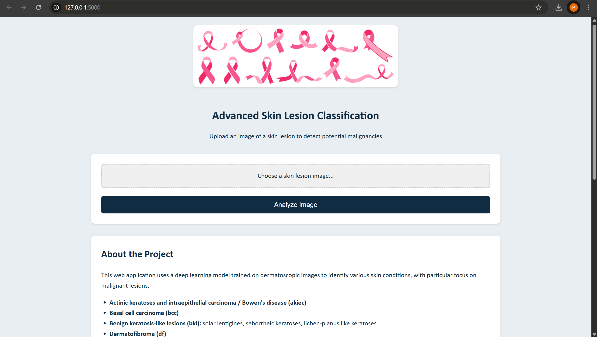

# skin cancer prediction

## Overview
A deep learning-based web application for classifying dermatoscopic images of skin lesions into seven diagnostic categories:
- Actinic keratoses and intraepithelial carcinoma / Bowen's disease (akiec)
- Basal cell carcinoma (bcc)
- Benign keratosis-like lesions (bkl)
- Dermatofibroma (df)
- Melanoma (mel)
- Melanocytic nevi (nv)
- Vascular lesions (vasc)

**Disclaimer:** This tool is not a substitute for professional medical advice. Always consult a dermatologist for proper diagnosis.

Click on Photo for wathing Demo:
[](https://www.youtube.com/watch?v=tnCIMnDahJU)


## Features
- 🖼️ Image upload interface for skin lesion analysis
- 🧠 Deep learning model for classification
- 📊 Probability distribution visualization
- 📝 Detailed interpretation of results
- ⚠️ Important medical disclaimers

## Technology Stack
### Backend
- Python 3.8+
- Flask (web framework)
- TensorFlow/Keras (deep learning)
- OpenCV (image processing)
- NumPy (numerical operations)

### Frontend
- HTML5
- CSS3
- JavaScript (basic interactivity)

### Model Architecture
- ResNet50V2 (pretrained on ImageNet)
- Custom classification head
- Transfer learning approach

## Installation
### Prerequisites
- Python 3.8+
- pip
- virtualenv (recommended)

### Setup
1. Clone the repository:
   ```bash
   git clone https://github.com/yourusername/skin-lesion-classifier.git
   cd skin-lesion-classifier
